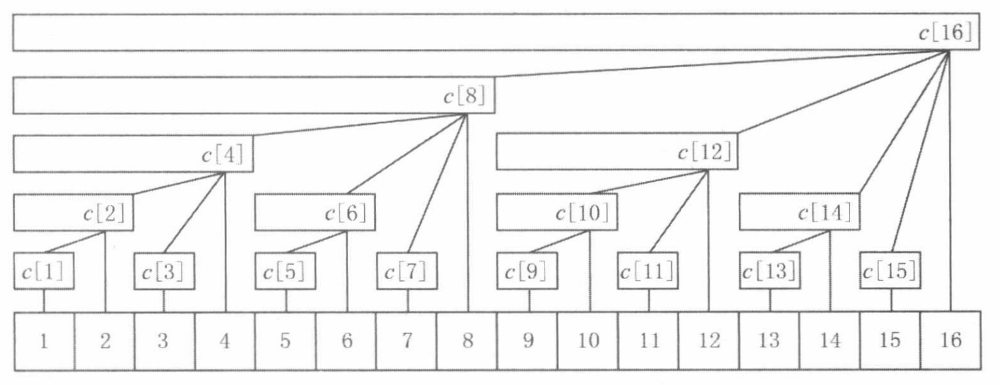
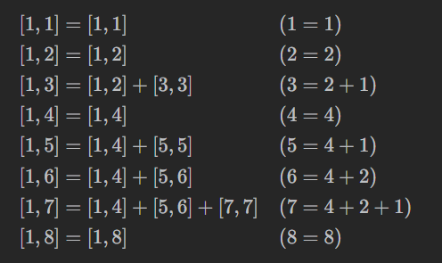

# 树状数组

相关力扣题目链接：

- [2179. 统计数组中好三元组数目](https://leetcode.cn/problems/count-good-triplets-in-an-array/)
- [307. 区域和检索 - 数组可修改](https://leetcode.cn/problems/range-sum-query-mutable/)

## 快速回顾（复习时用）

- 树状数组维护的是什么？



- 和前缀和的关系？
- 如何查询？如何更新？
  - `i -= lowbit(i)`就是把位置`i`的前缀和拆分成若干关键区间，`i += lowbit(i)`就是遍历每个包含位置`i`的关键区间
- `lowbit`操作怎么用位运算简洁实现？
  - `lowbit(i) = i & -i`。

## 求解连续子数组的和：前缀和的不足

给定一个数组`nums`，我们可以用一个辅助数组`prefix`，维护每个前缀和的值，即 `prefix[i] = sum(nums[:(i + 1)])`。这样，对于每个有关`nums`的连续子数组的和的问询，如`sum(nums[left:(right + 1)])`，我们就可以用`O(1)`的时间求得，具体为：`ret = prefix[right] - prefix[left - 1]`。

当数组的值会不断更新时，为了依然能正确求得连续子数组的和，我们同样需要更新辅助数组的值。对于前缀和辅助数组来说，当`nums[i]`更新时，所有包括位置`i`的前缀和，都需要得到更新，因此在最坏情况下，更新操作需要`O(n)`。

有什么办法能加速更新操作呢？显然，如果每次`nums[i]`更新时，始终有少于`O(n)`的辅助数组里的值需要被更新，那么就可以实现优化。比`O(n)`好的有`O(log n)`和`O(1)`。要实现`O(1)`更新，辅助数组（暂且记为`help`吧）则势必要求和原数组元素一一对应，即`help[i] = f(nums[i])`。在“求解连续子数组的和”问题的背景下，辅助数组每个位置维护的就是区间`[i, i]`的部分和（此处是对应，前缀和数组维护的是区间`[0, i]`的部分和）。如此，当查询`sum(nums[left:(right + 1)])`时，我们的辅助数组和原数组无异，需要`O(n)`才能求得结果。

既然`O(1)`的更新会带来`O(n)`的查询，我们还可以考虑`O(log n)`的更新，如果它能得到`O(log n)`的查询，我们就得到了原数组和前缀和两者的中间态，平衡查询和更新的时间复杂度。这就是树状数组的发明动机。

## 从前缀和到树状数组：区间的拆分

之前提到，前缀和数组更新慢的原因是，当`nums[i]`更新时，`prefix[i:]`的部分都要更新。为了实现`O(log n)`的更新，我们要以一种二进制的办法重新表示每个前缀和，保证位置`i`的前缀和，是`O(log i)`个辅助数组里的元素的函数（在“求解连续子数组的和”问题中，就是这些元素的加和）。再想想，位置`i`的前缀和等于哪几个区间部分和的加和？

为了更方便地思考，我们令下标从`1`开始。



我们把这种拆分方法严谨化：

- 如果`i`是`2`的幂，那么`[1,i]`无需拆分。
- 如果`i`不是`2`的幂，那么先拆分出一个最小的`2`的幂，记作`lowbit(i)`（例如`6`拆分出`2`），得到长为`lowbit(i)`的**关键区间**`[i − lowbit(i) + 1, i]`，问题转换成剩下的`[1, i − lowbit(i)]`如何拆分，这是一个规模更小的子问题。

将一个位置`i`的完整前缀和拆分成的若干**关键区间的部分和**，就是树状数组要维护的元素。那关键区间的数量是否和原数组长度相同呢？

答案是肯定的。

证明：按顺序拆分前缀`[1,1], [1,2], [1,3], …, [1,n]`，每次只会恰好拆出一个新的关键区间`[i − lowbit(i) + 1, i]`（注意`[1, i − lowbit(i)]`之前拆分过了，不会产生新的关键区间），所以一共有`n`个不同的关键区间。

我们记树状数组为`tree`。

## 查询操作

按照如下方法（记为`prefix(i)`）计算前缀`[1, i]`的元素和：

- 初始化元素和`ret = 0`。
- 每次循环，把`tree[i]`加到`ret`中，对应关键区间`[i − lowbit(i) + 1, i]`的元素和。
- 然后更新`i`为`i − lowbit(i)`，表示接下来要拆分`[1, i − lowbit(i)]`，获取其中关键区间的元素和。
- 循环直到`i = 0`为止。
- 返回`ret`。

要计算区间`[left, right]`的部分和，就是`ret = prefix(right) - prefix(left - 1)`。

## 更新操作


假设下标`x`发生了更新，那么所有包含`x`的关键区间都会被更新。

例如下标`5`更新了，那么关键区间`[5,5], [5,6], [1,8], [1,16]`都需要更新，这三个关键区间的右端点依次为 `5,6,8,16`。

注意到：

- `5 + lowbit(5) = 5 + 1 = 6`
- `6 + lowbit(6) = 6 + 2 = 8`
- `8 + lowbit(8) = 8 + 8 = 16`

**猜想：如果`x`是一个被更新的关键区间的右端点，那么下一个被更新的关键区间的右端点为`x + lowbit(x)`。**

我们需要证明两点：

- 右端点为`x`的关键区间，被右端点为`x + lowbit(x)`的关键区间包含。
- 右端点在`[x + 1, x + lowbit(x) − 1]`内的关键区间，与右端点为`x`的关键区间没有任何交集。

证明过程可以参阅灵神原题解 [307. 区域和检索 - 数组可修改 - 力扣（LeetCode）](https://leetcode.cn/problems/range-sum-query-mutable/solutions/2524481/dai-ni-fa-ming-shu-zhuang-shu-zu-fu-shu-lyfll/)

在“求解连续子数组的和”问题中，更新操作是把某一位置从旧值更新到新值。假设我们同时维护原数组和辅助数组（树状数组）。对于`update(index, val)`，算法如下：

- 设`delta = val − nums[index]`，相当于把`index`的元素增加了这么多。然后把`nums[index]`更新成`val`。
- 初始化`i = index + 1`（注意下标从`1`开始），这是第一个被更新的关键区间的右端点。
- 不断循环直到`i > n`，这里`n`是`nums`的长度。
- 每次循环，把`tree[i]`增加`delta`。
- 然后更新`i`为`i + lowbit(i)`，即下一个被更新的关键区间的右端点。

## 初始化操作

### 写法一：`O(n log n)`

最简单的做法是，把`tree[i]`初始化成`0`，然后对每个`nums[i]`，调用一次 `update(i, nums[i])`。

### 写法二：`O(n)`

其实可以把这些`update`操作合并到一起。从`1`开始枚举`i`，把`nums[i−1]`加到`tree[i]`后，`tree[i]`就算好了，直接把`tree[i]`加到下一个关键区间的元素和中，也就是加到`tree[i + lowbit(i)]`中。下下一个关键区间的元素和由 `tree[i + lowbit(i)]`来更新，我们只需要继续往后枚举`i`就行。

## `lowbit`的位运算实现

```c++
     s = 101100
    ~s = 010011
(~s)+1 = 010100 // 根据补码的定义，这就是 -s。即 s 的最低 1 左侧取反，右侧不变
s & -s = 000100 // lowbit
```

补码取负的规则正好可以用于`lowbit`（找到最低`1`），因此`lowbit(i) = i & -i`。

<br>

---

> 📄 笔者：mangoMilkT
>
> 🕒 写于：2025.4.15
>
> 📝 版权所有，转载请注明出处。

